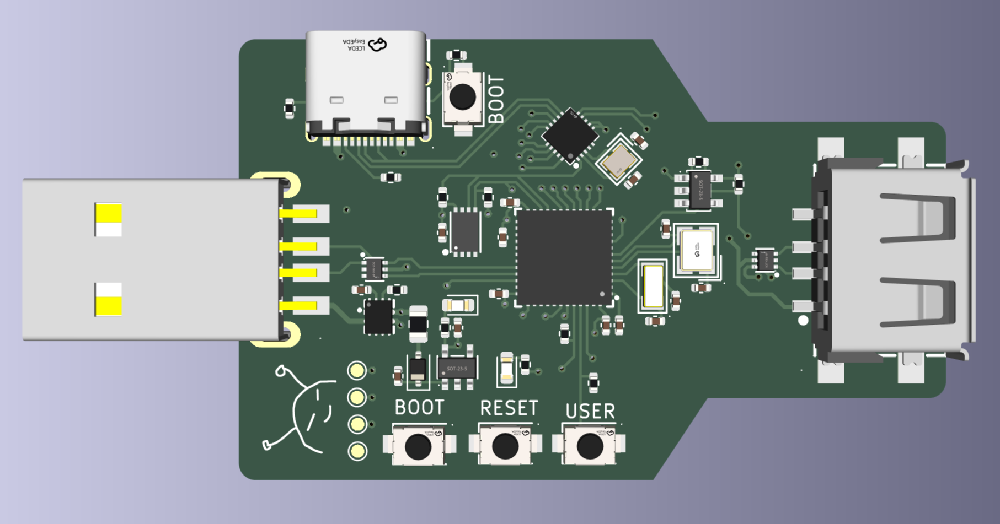

# USBsp

Have you ever tried to plug a USB device into a computer that has USB restrictions enabled? It's frustrating, isn't it? You can't use your USB devices, and you have no way to bypass the restrictions. But what if I told you that you could spoof the USB identifiers so you bypass these restrictions? That's where USBsp comes in.

Here is your solution!



USBsp is a USB device that can spoof the USB identifiers of any device you want. It is based on the CH32V203 and CH572D microcontrollers. With USBsp, you can easily bypass USB restrictions and use your USB devices without any issues.

## Features

- Spoofs basic USB descriptor fields: VID, PID, bcdDevice, manufacturer, product and serial.
- Stores the spoofed descriptor settings in EEPROM.
- WebUSB control panel for changing settings from a Chromium-based browser.
- Can read descriptor-like values from the currently connected downstream USB device and use them as a starting point.
- Basic live packet capture.
- Simple HID keyboard/mouse visualizers.

## Building

The required toolchain is alredy included. It is a custom toolchain made by WCH, downloaded from [here](https://www.mounriver.com/download). This toolchain constains custom targets for their MCUs. Other toolchains (like xpack) have not been tested.

### Clone the repository and add the toolchain to the path

```
git clone https://github.com/Ismael034/usbsp.git
cd usbsp
export PATH=$PWD/toolchain/bin/:$PATH
```

### Configure meson

```
meson setup build-ch32v203 --cross-file ch32v203/ch32v203-cross.ini
meson setup build-ch572d --cross-file ch572d/ch572d-cross.ini
```

### Build with ninja

```
ninja -C build-ch32v203 ch32v203/ch32v203.hex
ninja -C build-ch572d ch572d/ch572d.hex
```

If everything goes well, you'll end up with two .hex files – one for each MCU.

## Flashing

To flash the firmware to your MCU, you can use one of the following tools:

- [WCH-LinkUtility](https://www.wch.cn/downloads/wch-linkutility_zip.html)
- [wlink](https://github.com/ch32-rs/wlink/)
- [OpenOCD](https://openocd.org/)

```
wlink flash ./build-ch32v203/ch32v203/ch32v203.hex
wlink flash ./build-ch572d/ch572d/ch572d.hex
```

## Tests

It is also possible to build a test firmware, which will test hardware funcionality like EEPROM access, USBD, USBH, buttons, etc. You can build it using a predefined custom target.

```
ninja -C build-ch32v203 ch32v203/ch32v203_test.hex
```
